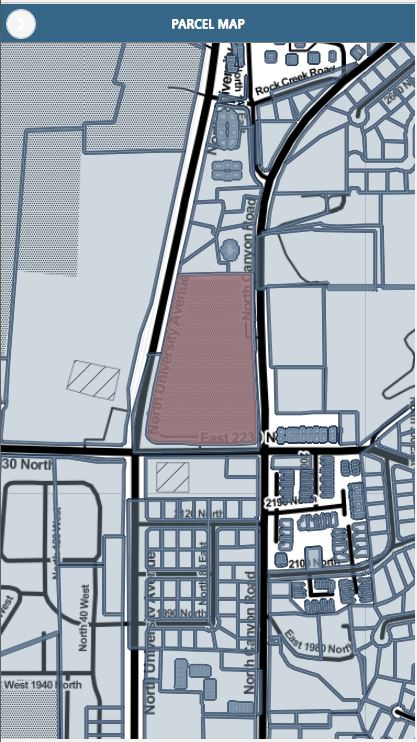
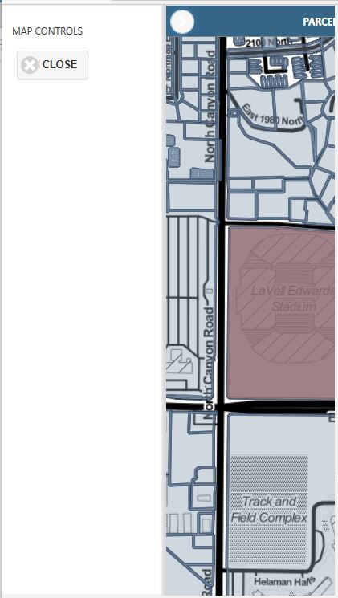

# Cordova app for Utah Country parcel

This is just a simple cordova app for turning html projects into mobile(ios, android, windows) apps that I put togther while watching the superbowl. Its very basic but shows the possibilites. 

npm install will need to be ran before using.

The most common comands:

```
cordova build browser'
cordova build ios

cordova run browser
cordova run ios
```

This is just to show capabilites. This app is using the backend to the web version in another of my repos.






